# Enterprise IT & Security Home Lab

## Overview
This project documents a Windows enterprise lab environment built to practice IT support and cybersecurity operations.

The lab simulates a corporate network with centralized authentication, endpoint management, and security monitoring.

## Technologies Used
- Windows Server 2022 (Domain Controller)
- Active Directory & DNS
- Windows 11 Pro Client
- VirtualBox
- Ubuntu Server - Wazuh SIEM
- Internal Network (LabNet)

## Lab Architecture
- DC01 – Domain Controller, DNS
- PC01 – Domain Client
- Domain: lab.local

## Key Skills Demonstrated
- Installed and configured Active Directory Domain Services
- Created and managed domain users
- Joined Windows clients to domain
- Configured DNS and static IPs
- Troubleshot connectivity and authentication issues
- Implemented Group Policy to enforce automatic screen lock and password protection
- Verified policy deployment using gpresult and gpupdate
- Created file shares and implemented NTFS and share permissions
- Deployed Group Policy drive mapping based on security groups
- Configured domain password and account lockout policies
- Performed account unlocks and password resets using GUI and CLI
- Installed and secured osTicket on Windows using XAMPP
- Created agent and user roles
- Managed ticket lifecycle from submission to resolution
- Documented incident response workflows
- Using Wazuh I detected and investigated failed logins (Event ID 4625), account lockouts (Event ID 4740) and privilege escalation (Event ID 4732)

## Screenshots

### Active Directory Users
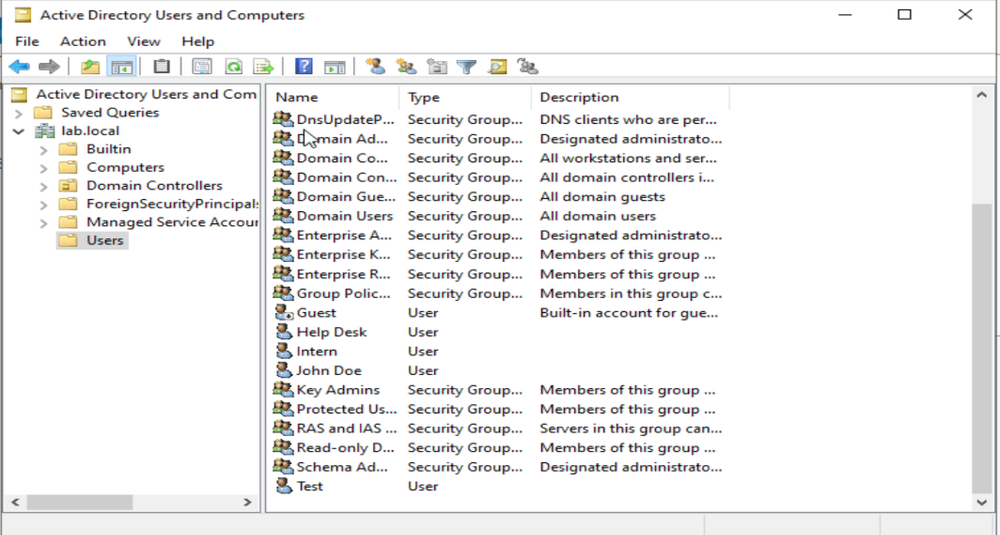

### Server Manager
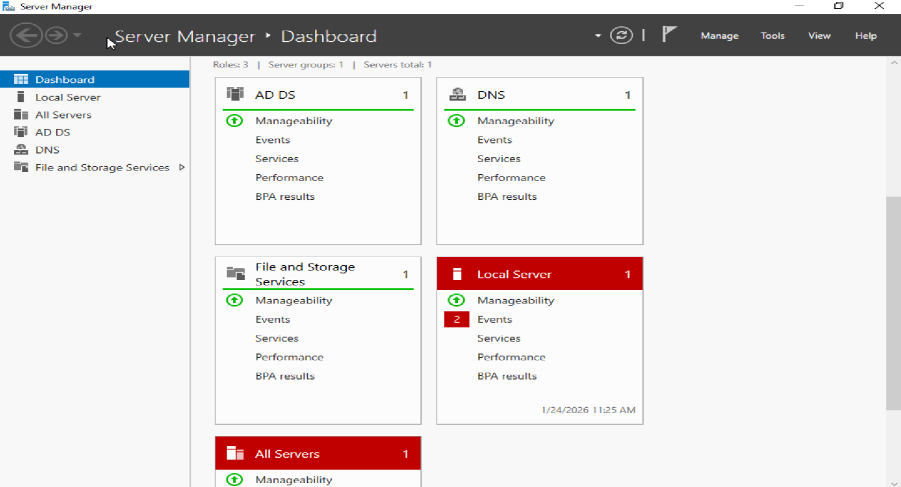

### Domain Membership
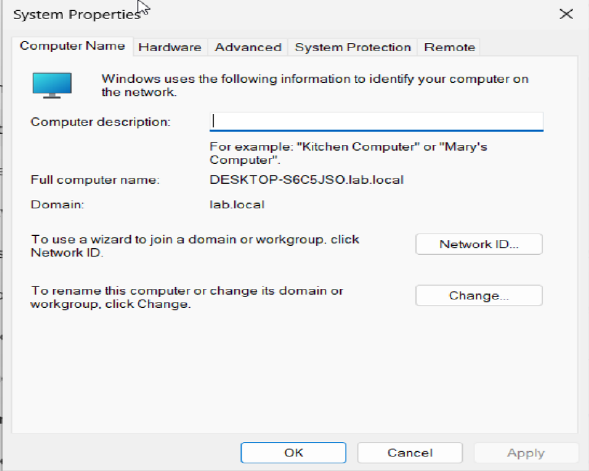

### Domain Login
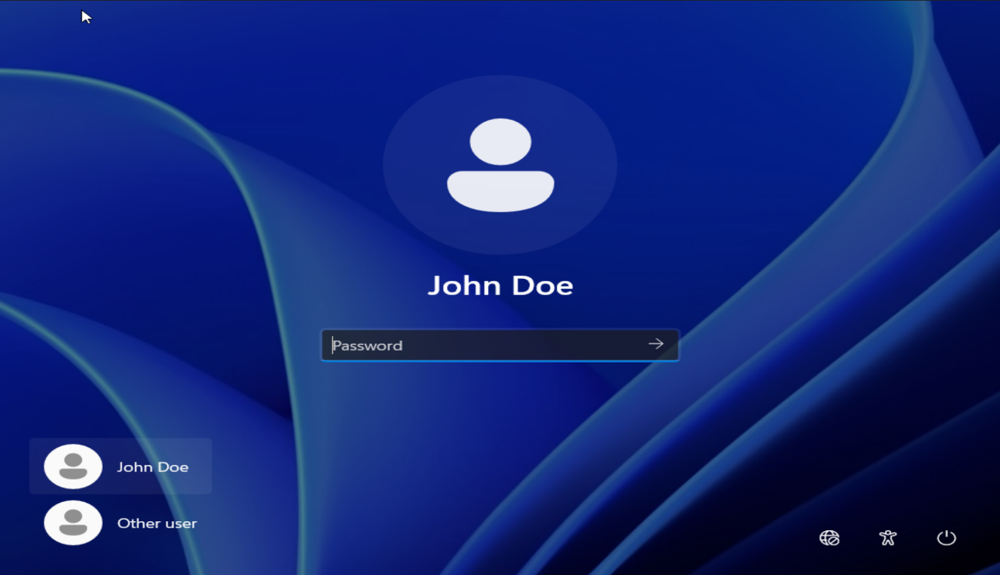

### Network Test
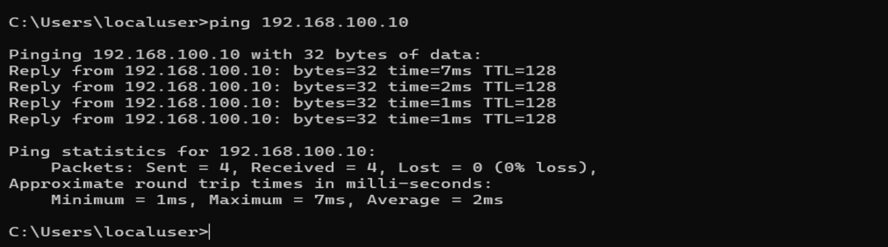

### Group Policy – Screen Lock Enforcement
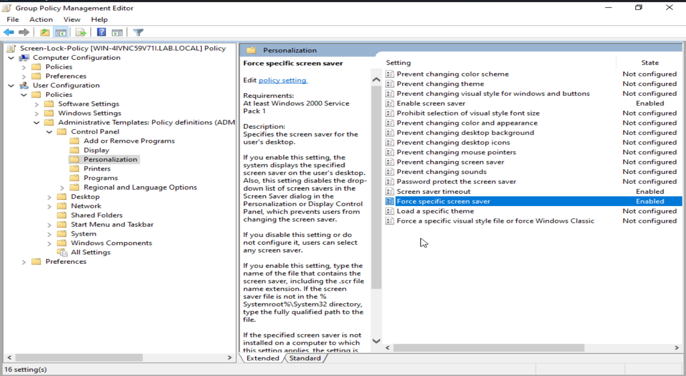

### File Server and Drive Mapping
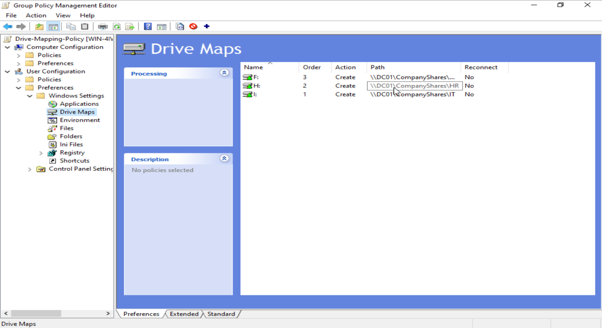
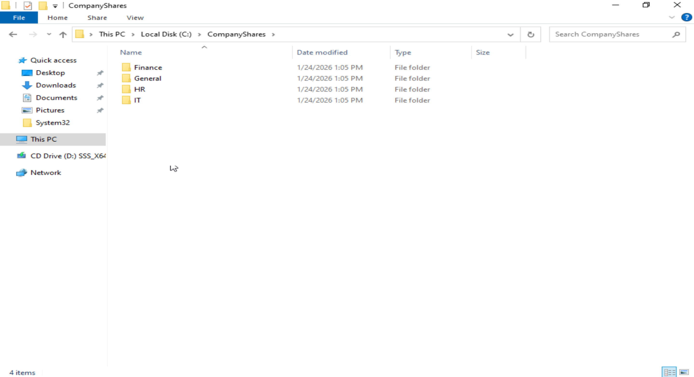
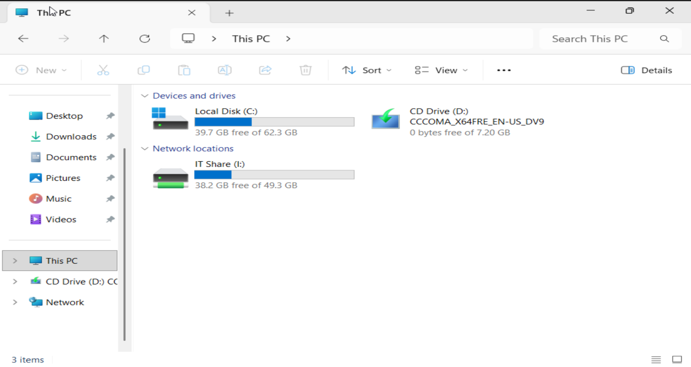

### Password Policy and Account Management
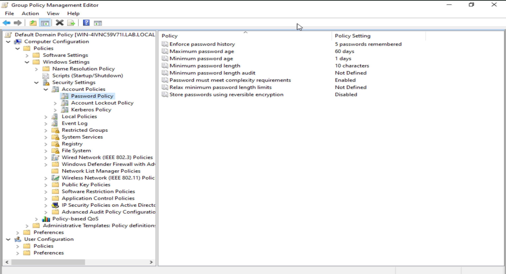
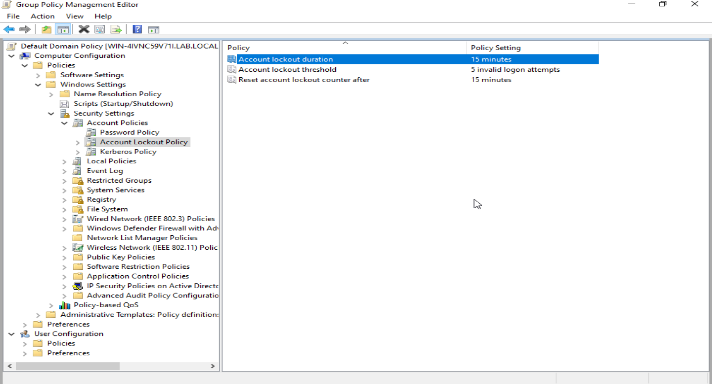
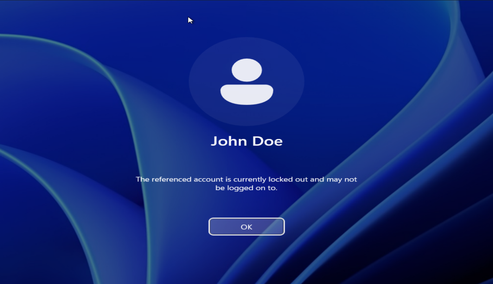
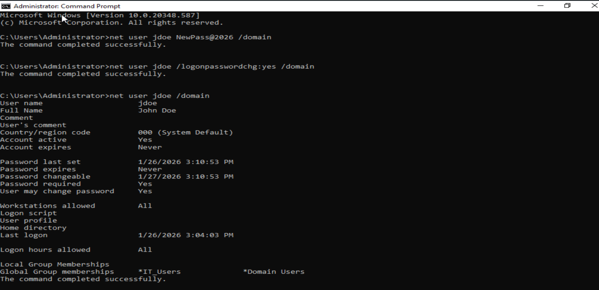

### Helpdesk Ticketing System (osTicket)
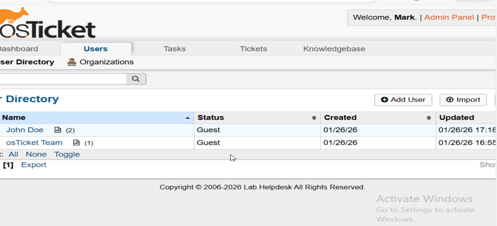
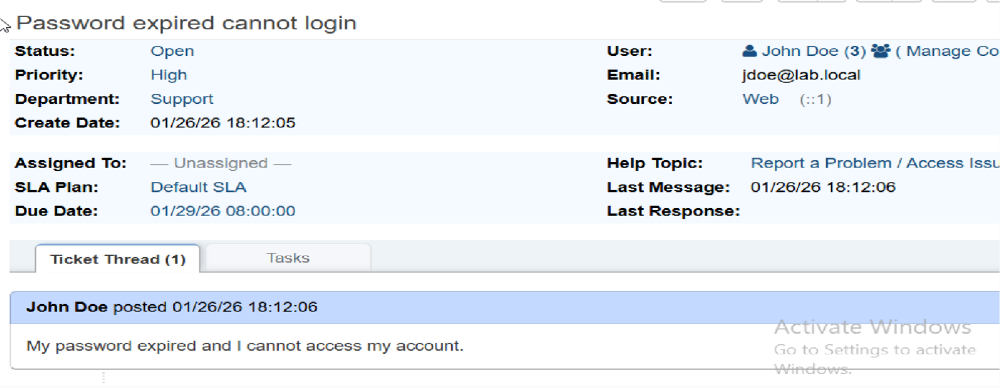
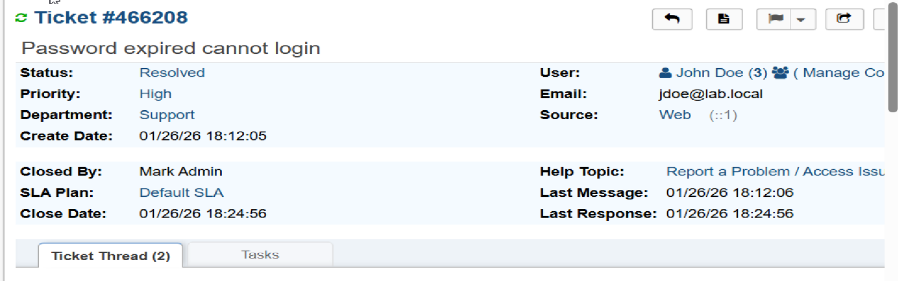

## Security Monitoring SIEM (Wazuh)
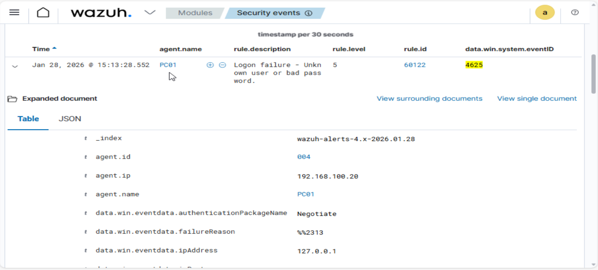
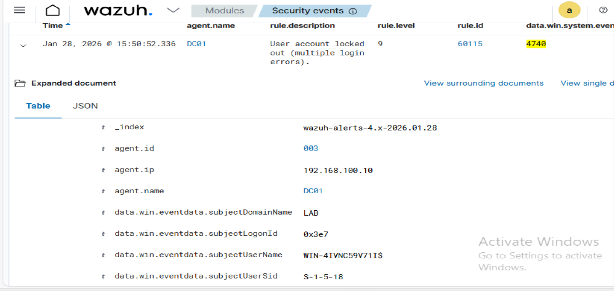
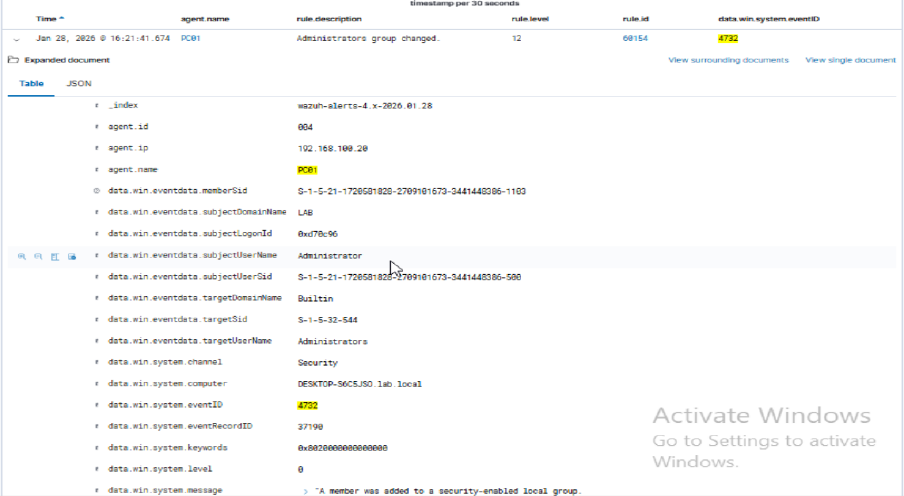

## Lessons Learned
- Importance of time synchronization for log analysis
- Troubleshooting DNS and network connectivity issues
- Managing endpoint security agents
- Following least privilege principles
- Documenting incidents and resolutions

## Future Improvements
- Integrate vulnerability scanning
- Build custom Wazuh dashboards
- Add cloud-based monitoring
- Automate deployment with scripts
